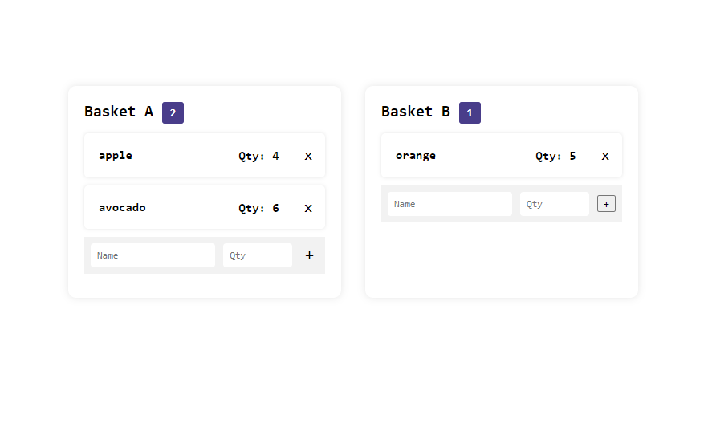

## JavaScript to create a list of fruits in baskets.
A simple school activity to create two baskets containing a list of fruits. Each item on the basket should display the fruit's name and quantity using JavaScript.

Test it here : https://fruit-baskets.netlify.app

